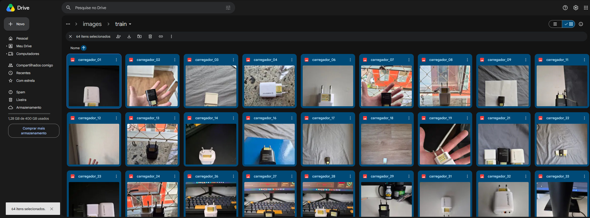
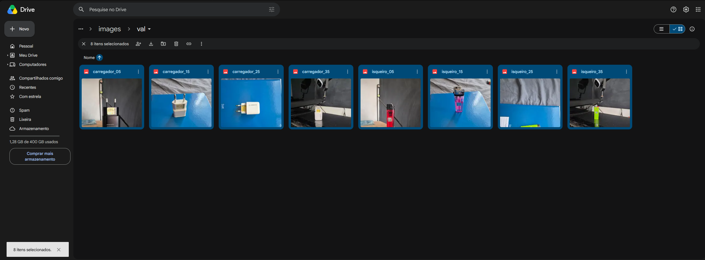
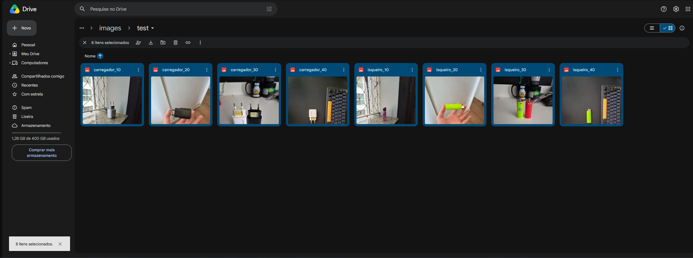
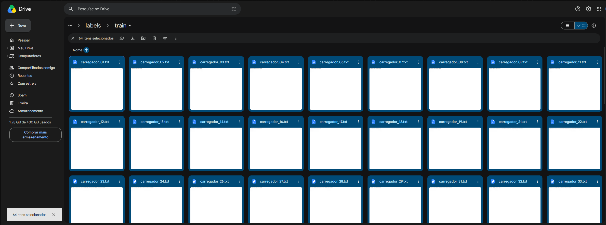
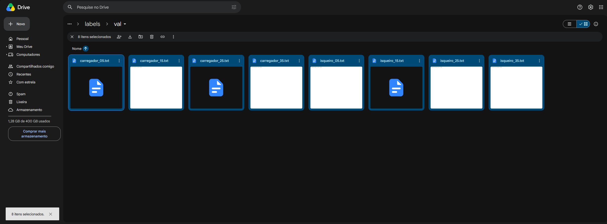
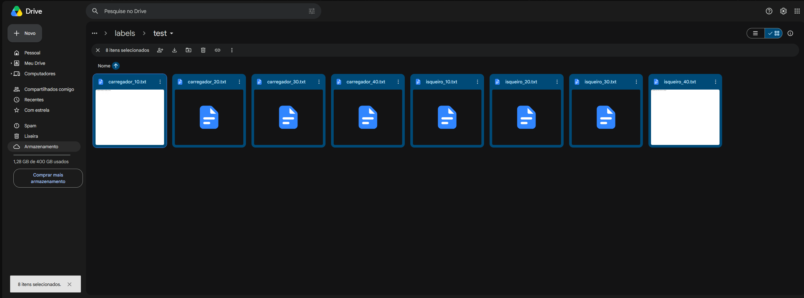
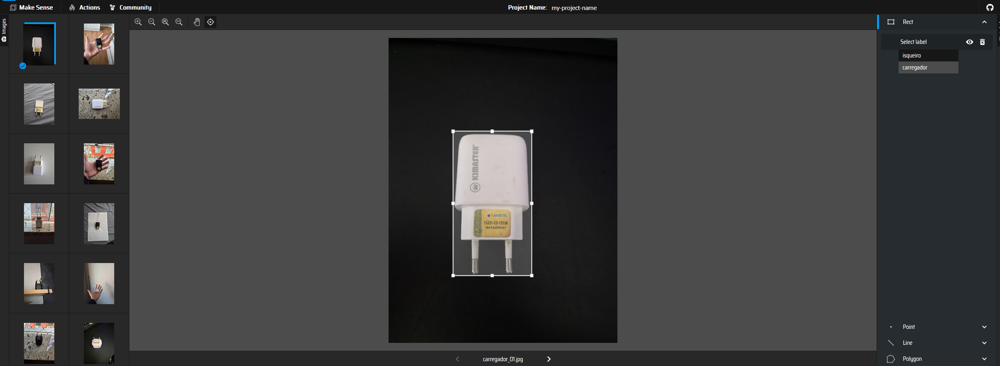

# FarmTech Solutions — Visão Computacional com YOLO (Fase 6)

**Aluno:** Vitor Rodrigues Pasqualotto — RM 570440
**Curso:** Inteligência Artificial — FIAP

## Sobre o projeto

A FarmTech Solutions está expandindo seus serviços de IA para a visão computacional. Este projeto demonstra, para um cliente, como um sistema de detecção de objetos funciona na prática: um modelo YOLOv5 foi customizado para reconhecer dois objetos (isqueiro e caixa de carregador) a partir de 80 fotos autorais, e depois comparado com outras abordagens sobre a mesma base.

## O que foi feito

| Parte | Conteúdo |
|---|---|
| **Entrega 1** | YOLOv5 customizado, com duas simulações de treino (30 e 60 épocas), validação e teste |
| **Entrega 2** | YOLO padrão (sem customização) e CNN treinada do zero, com comparação das três abordagens |
| **Ir Além** | Transfer Learning e Fine Tuning com MobileNetV2, e segmentação automática com U²-Net |

## Notebook

Todo o passo a passo, o código executado, os resultados e as conclusões estão no notebook:

- [VitorRodriguesPasqualotto_rm570440_pbl_fase6.ipynb](VitorRodriguesPasqualotto_rm570440_pbl_fase6.ipynb)
- [Abrir no Google Colab](https://colab.research.google.com/github/vitor-pasqualotto/farmtech-fase6-visao-computacional/blob/main/VitorRodriguesPasqualotto_rm570440_pbl_fase6.ipynb)

## Vídeo de demonstração

[Assistir no YouTube](LINK_DO_VIDEO)

## Dataset

As 80 imagens e os rótulos em formato YOLO estão no Google Drive:
[pasta do dataset](https://drive.google.com/drive/folders/1Ve0eygC0r811qAPeTGZYZO-f5VirQ7hU?usp=sharing)

```
dataset/
├── images/
│   ├── train/   64 imagens (32 por objeto)
│   ├── val/      8 imagens (4 por objeto)
│   └── test/     8 imagens (4 por objeto)
└── labels/      mesma divisão, um arquivo .txt por imagem
```

### Imagens no Google Drive

| Treino | Validação | Teste |
|---|---|---|
|  |  |  |

### Rótulos no Google Drive

| Treino | Validação | Teste |
|---|---|---|
|  |  |  |

### Rotulagem no Make Sense AI



## Como executar

1. Abra a pasta do dataset pelo link acima e adicione um atalho dela ao seu Google Drive.
2. Abra o notebook no Google Colab e selecione o ambiente de execução com GPU T4.
3. Na segunda célula de código, ajuste a variável `BASE` para o caminho da pasta `dataset` no seu Drive.
4. Execute as células em ordem.

O treino tem componentes aleatórios, então uma nova execução produz métricas um pouco diferentes das registradas no notebook.

## Tecnologias

Python, YOLOv5, TensorFlow/Keras, MobileNetV2, U²-Net (rembg), Google Colab e Make Sense AI.
